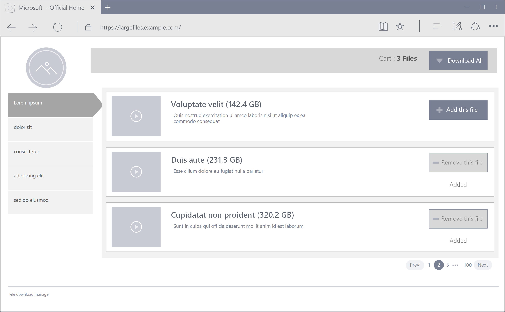
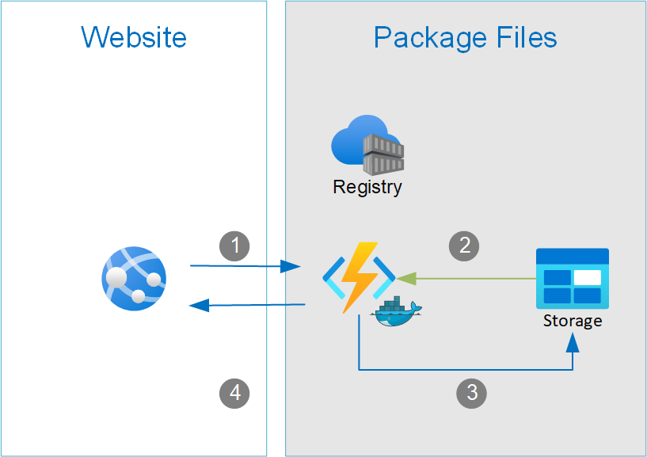

# Large File Download

Example architecture to download very large files. Option to collect many files into one file.

This project demonstrates how to download large files using several Azure technologies:

- Azure Functions
- Azure Containers
- Azure Storage

Business Use Case:



- Users add or remove files to the cart
- Selecting `Download All` will package selected files into one download

Locacal Architecture:



1. The website sends a list of filenames to an Azure Function.
2. Azure Functions retrieves the files and bundles them into a new package.
3. Azure Functions saves the package in blob storage.
4. Azure Functions returns a link to the newly uploaded package file.

# Setup

This setup will deploy the core infrastructure needed to run the the solution:

```bash
# Global
export RG_NAME=large_files
export RG_REGION=westus
export STORAGE_ACCOUNT_NAME=largefilessa

# Container Instance
export ACR_REGISTRY_NAME=packagefiles
export ACR_PASSWORD=<replace password>
export ACR_USER=largefileuser
export CONTAINER_IMAGE_NAME=packagefiles

# Function App
export FX_PLAN_NAME=largefilesplan
export FX_NAME=largefiles
export FX_RUNTIME=python

```

### Resource Group

Create a resource group for this project

```bash
az group create --name $RG_NAME --location $RG_REGION
```

### Storage Account

Create a storage account.

```bash
az storage account create -n $STORAGE_ACCOUNT_NAME -g $RG_NAME -l $RG_REGION --sku Standard_LRS
```

### Azure Container Registry

```bash
az acr create --resource-group $RG_NAME --name $CONTAINER_NAME --sku Basic
```

### Build and Upload Docker Image

```bash
 docker build --pull --rm -f "dockerfile" -t "{$CONTAINER_IMAGE_NAME}:latest" "."
 docker tag "{$CONTAINER_IMAGE_NAME}:latest" "{$ACR_REGISTRY_NAME}.azurecr.io/{$CONTAINER_IMAGE_NAME}:v1"

 az acr login --name $ACR_REGISTRY_NAME
 docker push "{$ACR_REGISTRY_NAME}.azurecr.io/{$CONTAINER_IMAGE_NAME}:v1"

 ```

### Function App

Create a function app using a Private ACR image.

```bash
az functionapp create -g $RG_NAME -p $FX_PLAN_NAME -n $FX_NAME --runtime $FX_RUNTIME --storage-account $STORAGE_ACCOUNT_NAME --deployment-container-image-name "{$ACR_REGISTRY_NAME}.azurecr.io/{$CONTAINER_IMAGE_NAME}:latest" --docker-registry-server-password $ACR_PASSWORD --docker-registry-server-user $ACR_USER
```

# References

- Azure Function App CLI docs https://docs.microsoft.com/en-us/cli/azure/functionapp?view=azure-cli-latest
- Python Azure SDK Storage https://docs.microsoft.com/en-us/azure/developer/python/azure-sdk-example-storage-use?tabs=cmd
